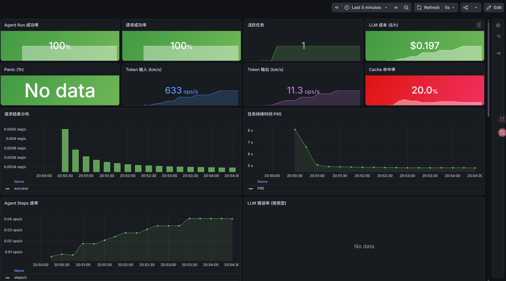
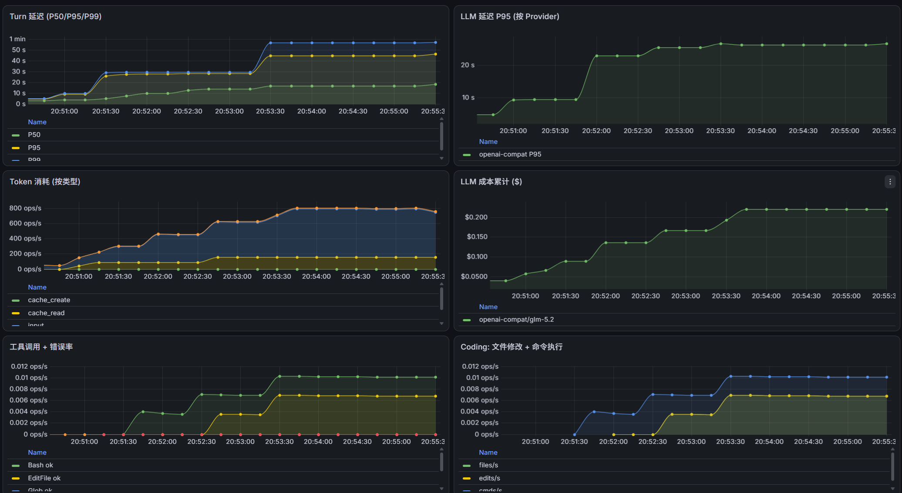
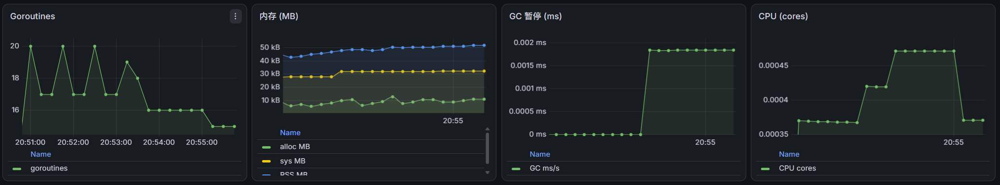

# MewCode

MewCode 是一个用 Go 编写的终端 AI 编程助手，支持多 LLM Provider、MCP 工具扩展、Skills 技能系统、多智能体协作和长期记忆。

## 目录结构

```
mewcode/
├── cmd/
│   └── mewcode/
│       ├── main.go              # 程序入口
│       ├── print.go             # -p/--print 非交互模式
│       └── teammate.go          # teammate 子命令（子 Agent 模式）
├── internal/
│   ├── agent/                   # 核心 Agent 循环
│   │   ├── agent.go
│   │   ├── events.go
│   │   └── streaming_executor.go
│   ├── agents/                  # 子 Agent 定义与加载
│   │   ├── definition.go
│   │   ├── loader.go
│   │   ├── subagent.go
│   │   ├── tool_filter.go
│   │   └── agent_tool.go
│   ├── commands/                # 斜杠命令系统
│   │   ├── commands.go
│   │   ├── loader.go
│   │   └── sandbox.go
│   ├── compact/                 # Layer 2 上下文压缩
│   │   ├── compact.go
│   │   └── recovery.go
│   ├── config/                  # 配置加载与合并
│   │   └── config.go
│   ├── conversation/            # 对话消息管理
│   │   └── conversation.go
│   ├── filehistory/             # 文件操作历史
│   │   └── filehistory.go
│   ├── history/                 # 命令历史
│   │   └── history.go
│   ├── hooks/                   # Hooks 钩子引擎
│   │   └── hooks.go
│   ├── llm/                     # LLM 客户端抽象层
│   │   ├── client.go            #   Client 接口与工厂
│   │   ├── anthropic.go         #   Anthropic Messages API
│   │   ├── openai.go            #   OpenAI Responses API
│   │   ├── openai_compat.go     #   OpenAI 兼容 Chat Completions API
│   │   ├── model_resolver.go
│   │   ├── errors.go
│   │   ├── events.go
│   │   └── metered.go           #   LLM 调用计量中间件
│   ├── metrics/                 # 性能指标采集
│   │   ├── metrics.go           #   指标接口与注册（63 个指标）
│   │   ├── noop.go              #   空实现（默认零开销）
│   │   └── prometheus.go        #   Prometheus 实现 + Go runtime collector
│   ├── mcp/                     # MCP Server 管理
│   │   └── mcp.go
│   ├── memory/                  # 记忆系统
│   │   ├── memory.go
│   │   ├── memory_types.go
│   │   ├── memory_scan.go
│   │   ├── memory_age.go
│   │   ├── find_relevant_memories.go
│   │   ├── instructions.go
│   │   ├── paths.go
│   │   ├── memdir.go
│   │   ├── extractor/           #   记忆自动提取
│   │   └── consolidation/       #   记忆整合
│   ├── permissions/             # 权限检查
│   │   └── permissions.go
│   ├── planfile/                # Plan 模式
│   │   └── planfile.go
│   ├── prompt/                  # 系统提示词构建
│   │   ├── builder.go
│   │   ├── sections.go
│   │   └── plan_mode.go
│   ├── remote/                  # 远程 WebSocket 服务
│   │   ├── server.go
│   │   └── web.go
│   ├── sandbox/                 # OS 级沙箱
│   │   ├── sandbox.go
│   │   ├── sandbox_darwin.go
│   │   ├── sandbox_linux.go
│   │   └── sandbox_other.go
│   ├── session/                 # 会话持久化
│   │   └── session.go
│   ├── skills/                  # Skills 技能系统
│   │   ├── skills.go
│   │   ├── catalog.go
│   │   ├── parser.go
│   │   ├── executor.go
│   │   ├── install.go
│   │   ├── builtins.go
│   │   ├── load_skill_tool.go
│   │   └── install_tool.go
│   ├── teams/                   # 多智能体团队
│   │   ├── teams.go
│   │   ├── runner.go
│   │   ├── coordinator.go
│   │   ├── spawn.go
│   │   ├── inprocess.go
│   │   ├── tmux.go
│   │   ├── iterm.go
│   │   ├── filemailbox.go
│   │   ├── tools.go
│   │   ├── progress.go
│   │   ├── transcript.go
│   │   └── backend.go
│   ├── todo/                    # TODO 列表管理
│   │   ├── todo.go
│   │   ├── store.go
│   │   └── tools.go
│   ├── toolresult/              # Layer 1 工具结果管理
│   │   ├── budget.go
│   │   ├── reconstruct.go
│   │   ├── record.go
│   │   └── state.go
│   ├── tools/                   # 内置工具
│   │   ├── tool.go              #   工具接口与注册表
│   │   ├── bash.go
│   │   ├── read_file.go
│   │   ├── write_file.go
│   │   ├── edit_file.go
│   │   ├── glob.go
│   │   ├── grep.go
│   │   ├── diff.go
│   │   ├── ask_user.go
│   │   ├── tool_search.go
│   │   ├── media_input.go
│   │   ├── enter_worktree.go
│   │   ├── exit_worktree.go
│   │   ├── exit_plan_mode.go
│   │   ├── file_state_cache.go
│   │   └── descriptions.go
│   ├── tui/                     # 终端 UI
│   │   ├── tui.go
│   │   ├── styles.go
│   │   └── verbs.go
│   └── worktree/                # Git worktree 管理
│       ├── create.go
│       ├── setup.go
│       ├── changes.go
│       ├── cleanup.go
│       ├── session.go
│       ├── agent.go
│       ├── env.go
│       ├── filesystem.go
│       ├── validate.go
│       └── notice.go
├── .mewcode/                    # 运行时目录（配置、会话、记忆、技能）
│   ├── config.yaml
│   ├── config.yaml.example
│   ├── sessions/
│   ├── skills/
│   ├── memory/
│   └── teams/
├── observability/               # 监控与可视化
│   ├── docker-compose.yml       #   Prometheus + Grafana 编排
│   ├── prometheus/
│   │   └── prometheus.yml       #   抓取配置
│   └── grafana/
│       ├── dashboards/
│       │   └── mewcode-overview.json  # 预置 Dashboard（24 个面板）
│       └── provisioning/
│           ├── datasources/
│           │   └── prometheus.yml     # 数据源自动配置
│           └── dashboards/
│               └── mewcode.yml        # Dashboard 自动加载
├── go.mod
├── go.sum
├── MEWCODE.md
└── README.md
```

## 快速开始

### 1. 编译

```bash
# Linux / macOS
go build -o mewcode ./cmd/mewcode

# Windows（必须带 .exe 扩展名，否则系统无法识别为可执行文件）
go build -o mewcode.exe ./cmd/mewcode
```

### 2. 配置

在项目根目录创建 `.mewcode/config.yaml`（参考 `.mewcode/config.yaml.example`）：

```yaml
providers:
  - name: anthropic-official
    protocol: anthropic
    base_url: https://api.anthropic.com
    api_key: "your-api-key"
    model: claude-sonnet-4-20250514
    thinking: true

mcp_servers:
  - name: context7
    command: npx
    args: ["-y", "@upstash/context7-mcp"]
```

### 3. 运行

```bash
# 交互式 TUI
# Linux / macOS
./mewcode
# Windows
.\mewcode.exe

# 非交互模式
# Linux / macOS
./mewcode -p "解释这个项目"
# Windows
.\mewcode.exe -p "解释这个项目"

# 远程模式（启动 WebSocket 服务）
# Linux / macOS
./mewcode --remote :18888
# Windows
.\mewcode.exe --remote :18888
```

## 性能监控与可视化

MewCode 内置 Prometheus 指标采集和 Grafana 可视化，覆盖 6 个层级共 63 个指标：







| 层级 | 指标 | 说明 |
|---|---|---|
| **请求层** | `agent_requests_total` `agent_active_tasks` `agent_task_duration_seconds` | 请求计数、活跃任务、任务耗时 |
| **Agent 层** | `agent_steps_total` `agent_step_duration_seconds` `agent_max_steps_reached_total` `agent_task_timeout_total` | 步骤计数、轮次延迟、步数上限、超时 |
| **LLM 层** | `agent_llm_requests_total` `agent_llm_errors_total` `agent_llm_duration_seconds` `agent_llm_input_tokens_total` `agent_llm_output_tokens_total` `agent_llm_cost_total` | LLM 调用、错误、延迟、Token（输入/输出）、成本 |
| **Tool 层** | `agent_tool_calls_total` `agent_tool_errors_total` `agent_tool_duration_seconds` | 工具调用、错误、延迟 |
| **Coding 层** | `agent_files_modified_total` `agent_code_edits_total` `agent_command_executions_total` `agent_build_total` `agent_build_success_total` `agent_tests_total` `agent_tests_passed_total` `agent_tests_failed_total` | 文件修改、代码编辑、命令执行、构建、测试 |
| **资源层** | `go_goroutines` `go_memstats_alloc_bytes` `go_gc_duration_seconds` `process_cpu_seconds_total` `process_resident_memory_bytes` | Goroutine、内存、GC、CPU、RSS |

### 启用监控

在 `.mewcode/config.yaml` 中添加：

```yaml
observability:
  metrics:
    enabled: true
    path: /metrics
  health:
    enabled: true
```

### 启动监控栈

```bash
# 启动 Prometheus + Grafana（Docker Compose）
cd observability
docker compose up -d

# 启动 MewCode（远程模式，暴露 /metrics 端点）
./mewcode --remote :18888
```

### 访问

| 服务 | 地址 | 登录 |
|---|---|---|
| Grafana | http://localhost:3000 | admin / admin |
| Prometheus | http://localhost:9090 | 无需登录 |
| MewCode Web UI | http://localhost:18888 | 无需登录 |
| 指标端点 | http://localhost:18888/metrics | 无需登录 |
| 健康检查 | http://localhost:18888/healthz | 无需登录 |
| pprof 调试 | http://localhost:18888/debug/pprof/ | 无需登录 |

Grafana Dashboard 已预置（24 个面板），打开 http://localhost:3000/d/mewcode-overview 即可查看。

### 指标示例

```
agent_requests_total{outcome="success"}              # 请求成功数
agent_llm_cost_total{provider,model}                 # LLM 累计成本（美元）
agent_llm_tokens_total{type="input|output|cache_read"} # Token 消耗
agent_files_modified_total                            # 修改文件数
agent_build_total                                     # 构建次数
agent_command_executions_total                        # 命令执行数
go_goroutines                                         # Goroutine 数
process_resident_memory_bytes                         # 进程内存
```
